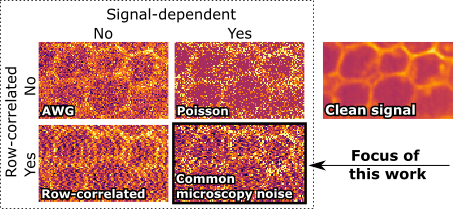

# [Unsupervised Denoising for Signal-Dependent and Row-Correlated Imaging Noise](https://arxiv.org/abs/2310.07887)<br>
## COSDD (COrrelated and Signal-Dependent Denoising)
<sup>1</sup>Benjamin Salmon and <sup>2</sup>Alexander Krull<br>
<sup>1, 2</sup>University of Birmingham<br>
<sup>1</sup>brs209@student.bham.ac.uk, <sup>2</sup>a.f.f.krull@bham.ac.uk<br>
This project includes code from the [ladder-vae-pytorch](https://github.com/addtt/ladder-vae-pytorch) project, which is licensed under the MIT License.





Abstract. Accurate analysis of microscopy images is hindered by the presence of noise. This noise is usually signal-dependent and often additionally correlated along rows or columns of pixels. Current self- and unsupervised denoisers can address signal-dependent noise, but none can reliably remove noise that is also row- or column-correlated. Here, we present the first fully unsupervised deep learning-based denoiser capable of handling imaging noise that is row-correlated as well as signal-dependent. Our approach uses a Variational Autoencoder (VAE) with a specially designed autoregressive decoder. This decoder is capable of modeling row-correlated and signal-dependent noise but is incapable of independently modeling underlying clean signal. The VAE therefore produces latent variables containing only clean signal information, and these are mapped back into image space using a proposed second decoder network. Our method does not require a pre-trained noise model and can be trained from scratch using unpaired noisy data. We show that our approach achieves competitive results when applied to a range of different sensor types and imaging modalities.

### BibTeX
```
@misc{salmon2024unsupervised,
      title={Unsupervised Denoising for Signal-Dependent and Row-Correlated Imaging Noise}, 
      author={Benjamin Salmon and Alexander Krull},
      year={2024},
      eprint={2310.07887},
      archivePrefix={arXiv},
      primaryClass={eess.IV}
}
```

### Dependencies
We recommend installing the dependencies in a conda environment. If you haven't already, install miniconda on your system by following this [link](https://docs.conda.io/projects/miniconda/en/latest/miniconda-install.html).<br>
Once conda is installed, create and activate an environment by entering these lines into a command line interface:<br>
1. `conda create --name cosdd`
2. `conda activate cosdd`


Next, install PyTorch and torchvision for your system by following this [link](https://pytorch.org/get-started/locally/).<br> 
After that, you're ready to install the dependencies for this repository:<br>
`pip install lightning jupyterlab matplotlib tifffile scikit-learn scikit-image tensorboard`

### Example notebooks
This repository contains 3 notebooks that will first download then denoise the [Actin Confocal dataset](https://watermark.silverchair.com/giab032.pdf?token=AQECAHi208BE49Ooan9kkhW_Ercy7Dm3ZL_9Cf3qfKAc485ysgAAA28wggNrBgkqhkiG9w0BBwagggNcMIIDWAIBADCCA1EGCSqGSIb3DQEHATAeBglghkgBZQMEAS4wEQQMNp66usQcgEtvRVhBAgEQgIIDIqEOU2J8_UXzM2uMp9UsceQvs4q5qhOrKB_Iv41q6E0LG8I-qkkIe4e1yg_4-YO0XAUyyaROAoNrSzdbQhO6MGZPrpSqro5JqEaEuLkM0DV98M9AC6K3Jzxb1punBipIK965CPicNNkjAfM01743w03xfIyeTDPK77r2-EKdQ23hV8_Z2otX8_nMAJ4vXH3BnPmjNLKFSW8a9ifaUUIfbLwOPneqCmWwngEYzL_vrEw8BCPLc0nqwSx95RFYytRNppHvx222vWBoDj_ohQc2-bWfqfpvvZQlxH4jsrkg4jJM0CMRM8rHN9PXCep4Vc6yfI5J7gcioB3G8Ag8xjHTzohp0r95CEt_oVL_1IPCZPZ_pFtJNseSVUo832N9svk7lR_lH6Yo_J7d5-NCc9q9fLZiTDHVlDBumF7yKhiEPUeORMsAckdUcYROr-aoOiBoO0Ph-MmZYoSsNCNkuxf7P1ewLgTROpliz5nsK3YFArgGWRoJTG06uT1m8jaxg3xpvUGX8sWSTqBxub3ma6W0uJtuVZEDYCzuXWbnM_xkY-OKW3L1-FVw9RKtkOD5E6grZzgv1-GEIqDc6nyVKlcjKM_3jkcaKBl7LGI6dYzF8VYhWyJrXxMS2p23QaCZZNmOjScPX_YPBopHD_jHZXVqiuJ0TUl8j_E4jwGgUBaDszFuMfOtPmOMMysaVkCRCNjm8rGeb_J9_sV0v-LsuCvRjqcDfhho1C1iRgg3UdkQUjPNIzg4iuk6PHks96enASCNQnf2FkIRNEGoQnVYcTYTNxowsPUyuJFFkXqrerMHJrx675R0BHuSJ8fArSDH-F_KxM5KB0wU5gWfaItBvzZQSlGfMTjssWkHHOQFVL1BX_sPk7wHcMx6WyOlMS6ahfwgD97lTXYRVz7oEOkXIjkhpE_4STQj7X6ATSfaZzILkPjigduZu4zXhw6fTUiLenKQ_AIvVt_PCy_is20teIyalvxK10U_wI4lAHowBCPBPR6QKhSR89amtHVVT4sr9XpyQQjoBin6FB1WmFvoqelDi9SkHK_9gSMikEjDg5xcZMv7Yi0). training.ipynb trains the denoising model, prediction.ipynb uses the trained model to denoise an inference set and generation.ipynb looks at the images that the model can generate.
